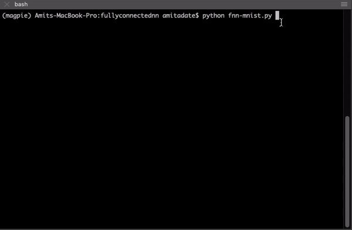

# pytorch-nn-scripts ( work in progress )

Scripts of neural architectures implemented in PyTorch. 

Intended to complement ongoing research, plug and play models with argument parsing. Each script runs with logging and saving progress along with generating graphs in one runtime.  

The pipeline used for the experiments is the following. 

    .
    ├── data              # data pulled by the script 
    ├── models            # ckpt files stored ( model state dictonary and optimizer state dictionary, to save progress)
    ├── logs              # logs saved after each runtime, based on input argument for saving / not saving
    ├── results           # folder for saving graphs based on input argument, (testing, training loss vs epochs )
    └── model.py          # script file from this repo, use model --help to get details about input arguments

Example for fully-connected-network on mnist: 

